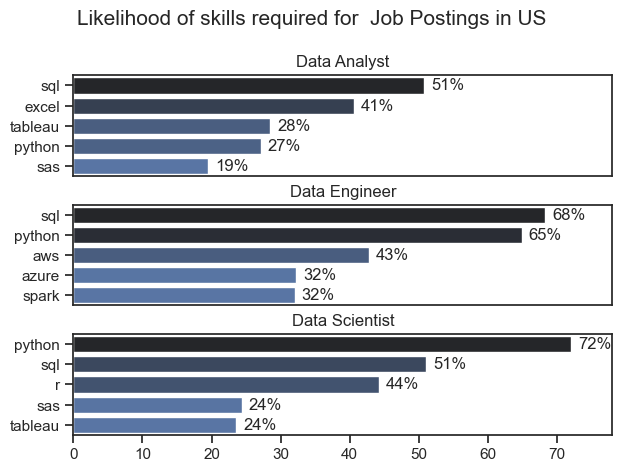
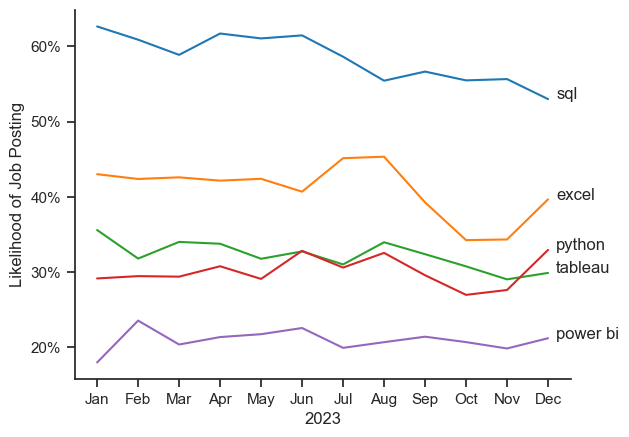
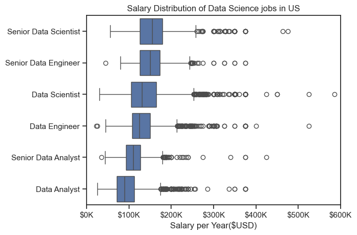
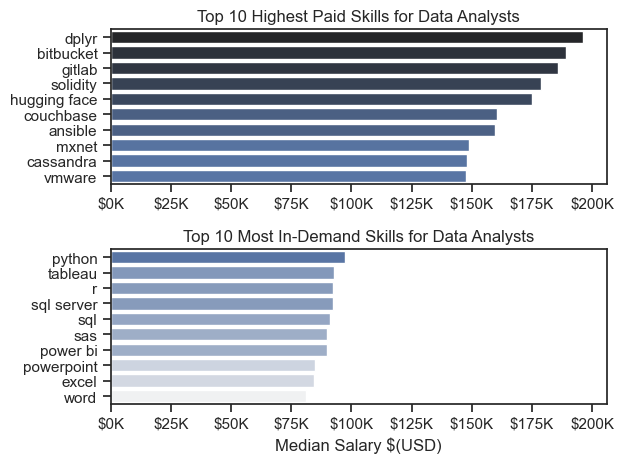
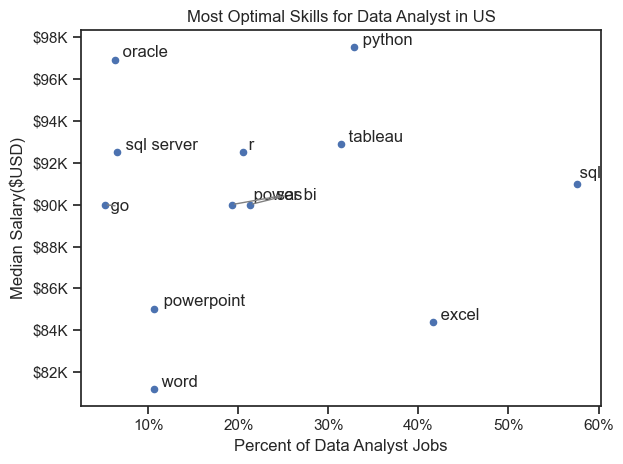
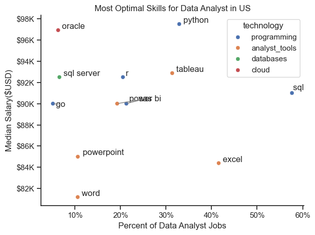

# Overview
 Welcome to my analysis of the data job market, specifically focusing on data analyst roles. This project aims to navigate and understand the job market more effectively by examining the highest-paying and most in-demand skills to identify the best job opportunities for data analysts.

The analysis is based on data from [Luke Barousse's Python Course,](https://www.lukebarousse.com/python)
 which provides a solid foundation with detailed information on job titles, salaries, locations, and key skills. Using a series of Python scripts, I explore crucial questions such as the most sought-after skills, salary trends, and the relationship between skill demand and salary in data analytics.

# The Questions
Below are the questions I want to answer in my project:

1. What are the skills most in demand for the top 3 most popular data roles?
2. How are in-demand skills trending for Data Analysts?
3. How well do jobs and skills pay for Data Analysts?
4. What are the optimal skills for data analysts to learn? (High Demand AND High Paying)

# Tools I Used 
For my in-depth exploration of the data analyst job market, I utilized several key tools:

- **Python:** The core tool for my analysis, enabling me to process the data and uncover critical insights. I employed the following Python libraries:
    - **Pandas:** Used for data analysis.
    - **Matplotlib:** Utilized for data visualization.
    - **Seaborn:** Assisted in creating advanced visualizations.
    - **Jupyter Notebooks:** Facilitated running Python scripts while allowing me to integrate notes and analysis seamlessly.
- **Visual Studio Code:** My preferred environment for executing Python scripts.
- **Git & GitHub:** Crucial for version control and sharing my Python code and analysis, ensuring effective collaboration and project tracking.

# Data Preparation and Cleanup

This section outlines the steps taken to prepare the data for analysis, ensuring accuracy and usability.
## Import & Clean Up Data
I begin by importing the required libraries and loading the dataset, then proceed with initial data cleaning tasks to ensure the quality of the data.
```python
# Importing Libraries
import ast
import pandas as pd
import seaborn as sns
from datasets import load_dataset
import matplotlib.pyplot as plt  

# Loading Data
dataset = load_dataset('lukebarousse/data_jobs')
df = dataset['train'].to_pandas()

# Data Cleanup
df['job_posted_date'] = pd.to_datetime(df['job_posted_date'])
df['job_skills'] = df['job_skills'].apply(lambda x: ast.literal_eval(x) if pd.notna(x) else x)
```
## Filtering US jobs
To focus my analysis on the U.S. job market, I applied filters to the dataset, narrowing down to roles based in the United States.
```python
df_US = df[df['job_country'] == 'United States']
```

# The Analysis

## 1. What are the most demanded skills for the top 3 most popular data roles?

To determine which skills are most in-demand for the top three data roles. I obtained the top 5 abilities for these top 3 roles by sorting the positions based on popularity. Depending on the role I'm considering, this query reveals the most popular job titles and their top competencies, indicating which skills I should focus on.

See my notebook with all the instructions here: [2_skill_demand.ipynb]()

### Visualize Data
```python 
fig, ax = plt.subplots(len(job_titles),1)

for i, job_title in enumerate(job_titles):
    df_plot = df_skill_perc[df_skill_perc['job_title_short'] == job_title].head(5)
    sns.barplot(data= df_plot, x ='skill_percent', y = 'job_skills', ax =ax[i],  hue= 'skill_count', palette= 'dark:b_r')
    ax[i].set_title(job_title)
    ax[i].set_ylabel('')
    ax[i].set_xlabel('')
    ax[i].legend().set_visible(False)
    ax[i].set_xlim(0,78)
   
    for n , v in enumerate(df_plot['skill_percent']):
        ax[i].text(v+1, n, f'{v:.0f}%', va='center')
    if i !=len(job_titles) -1: 
       ax[i].set_xticks([])

fig.suptitle('Likelihood of skills required for  Job Postings in US', fontsize = 15)
fig.tight_layout(h_pad=0.5)
```
### Results


### Insights
- With SQL being mentioned in more than half of job listings for both professions, it is the most sought-after ability for Data Scientists and Analysts. Python is the most sought-after talent for Data Engineers, showing up in 68% of job posts.

- Compared to Data analysts and Scientists, who are required to be skilled in more broad data management and analysis tools (Excel, Tableau), Data Engineers need more specialised technological capabilities (AWS, Azure, Spark).

- Across all three roles, but especially for Data Scientists (72%) and Data Engineers (65%), Python is a highly sought-after talent.

## 2.How are in-demand skills trending for Data Analysts?

I searched job posts for data analysts and grouped the talents according to the month in order to determine the abilities that are in demand for data analysts in 2023. I was able to obtain the top 5 data analyst skills by month, demonstrating the popularity of these skills in 2023.

See my notebook with step-by-step instructions here:[3_Skills_trend.ipynb]

### Visualize Data
```python

sns.lineplot(data=df_plot,dashes=False, palette='tab10')
sns.set_theme(style = 'ticks')
sns.despine()

from matplotlib.ticker import PercentFormatter

ax =plt.gca()
ax.yaxis.set_major_formatter(PercentFormatter(decimals =0))

plt.title = ('Trending Top Skills fo Data Analysts in the US')
plt.ylabel('Likelihood of Job Posting')
plt.xlabel('2023')
plt.legend().remove()

for i in range(5):
    plt.text(11.2, df_plot.iloc[-1,i], df_plot.columns[i])

```

### Results


### Insights

- Despite a steady decline in demand, SQL is still the most in-demand expertise during the entire year.
- Beginning in September, demand for Excel skyrocketed, eventually outpacing that of Tableau and Python as well.
- Although demand for Tableau and Python varies throughout the year, they are still necessary tools for data analysts. Even though it isn't as popular as the others, Power BI is trending slightly higher by the end of the year.

## 3. How well do jobs and skills pay for Data Analysts?

To determine the highest-paying roles and skills, I focused on jobs within the United States and examined their median salaries. Initially, I reviewed the salary distributions for common data positions such as Data Scientist, Data Engineer, and Data Analyst to identify which roles offer the highest pay.

You can view my notebook with the detailed steps here:
[4_Salary_analysis.ipynb]()

### Visualize Data
```python
sns.boxplot(data= df_US_top6, x= 'salary_year_avg', y = 'job_title_short', order=job_order)

ax= plt.gca()
sns.set_theme(style='ticks')
ax.xaxis.set_major_formatter(plt.FuncFormatter(lambda x, pos: f'${int(x/1000)}K' ))
plt.show()
```
### Results



### Insights

- **Significant Salary Variation:** Salary ranges vary widely across different job titles.
- **Highest Salary Potential:** Senior Data Scientist roles often have the highest salary potential, reaching up to $600K, reflecting the high value of advanced data skills and experience.
- **Outliers in Senior Roles:** Senior Data Engineer and Senior Data Scientist positions exhibit a notable number of high-end outliers, indicating that exceptional skills or unique circumstances can lead to higher pay.
-**Consistency in Data Analyst Salaries:** Data Analyst roles show more salary consistency with fewer outliers compared to senior roles.
- **Impact of Seniority and Specialization:** Median salaries increase with seniority and specialization. Senior roles (e.g., Senior Data Scientist, Senior Data Engineer) not only have higher median salaries but also show greater variability in typical compensation.

## Highest Paid & Most Demanded Skills for Data Analysts:
Next, I narrowed my analysis and focused only on data analyst roles. I looked at the highest-paid skills and the most in-demand skills. I used two bar charts to showcase these.

### Visualize Data
```python
fig , ax = plt.subplots(2,1)

sns.set_theme(style='ticks')
# Top 10 Highest Paid Skills for Data Analysts

sns.barplot(data= df_DA_top_pay, x ='median', y = df_DA_top_pay.index, ax =ax[0], hue ='median', palette= 'dark:b_r')


# Top 10 Most In-Demand Skills for Data Analysts')
sns.barplot(data= df_DA_skills, x ='median', y = df_DA_skills.index,hue ='median', ax =ax[1], palette= 'light:b')

ax[1].legend().remove()

plt.show()
```
### Results
Here's the breakdown of the highest-paid & most in-demand skills for data analysts in the US:




- **Top Graph Insights:** The top graph indicates that specialized technical skills such as dplyr, Bitbucket, and Gitlab are linked to higher salaries, with some reaching up to $200K, suggesting that advanced technical expertise can boost earning potential.

- **Bottom Graph Insights:** The bottom graph shows that foundational skills like Excel, PowerPoint, and SQL are the most sought after, despite not offering the highest salaries. This highlights the essential role these core skills play in securing data analysis positions.

- **Skill Distinction:** There is a clear difference between the highest-paying skills and those most in demand. Data analysts aiming to maximize their career prospects should focus on building a diverse skill set that includes both high-paying specialized skills and widely valued foundational skills.

## 4. What are the most optimal skills to learn for Data Analysts?

To determine the most advantageous skills to learn—those that offer the highest salaries and are in greatest demand—I calculated both the percentage of demand for each skill and their median salaries. This approach helps to clearly identify the best skills to focus on.

You can view the detailed steps in my notebook here: [5_Optimal_skills.ipynb]()

### Visualize Data
```python

from adjustText import adjust_text

# fig,ax = plt.subplots()


df_DA_skills_high_demand.plot(kind='scatter', x = 'skill_percent', y ='median_salary')
texts = []


plt.tight_layout()

plt.show()
```
### Results


## Insights

- **High Value on Oracle:** The skill Oracle stands out with the highest median salary of nearly $97K, despite its lower frequency in job postings. This indicates a significant value placed on specialized database skills in the data analyst field.

- **Common Skills vs. Specialized Skills:** Skills like Excel and SQL are frequently mentioned in job listings but have lower median salaries compared to specialized skills such as Python and Tableau. The latter not only offer higher salaries but also have moderate representation in job postings.

- **Top Salaries for Common Skills:** Skills like Python, Tableau, and SQL Server are among the higher-paying ones and are relatively common in job listings, suggesting that expertise in these tools can provide strong career opportunities in data analytics.

## Visualizing Different Techonologies
Let's visualize the different technologies as well in the graph. We'll add color labels based on the technology (e.g., {Programming: Python})

### Visualize Data
```python
from adjustText import adjust_text

df_plot= df_DA_skills_high_demand.merge(df_technology, left_on= 'job_skills', right_on= 'skills')

sns.scatterplot(data= df_plot, x = 'skill_percent', y = 'median_salary', hue ='technology')

sns.despine()


ax = plt.gca()
plt.xlabel('Percent of Data Analyst Jobs')
plt.ylabel('Median Salary($USD)')
plt.title('Most Optimal Skills for Data Analyst in US')

plt.tight_layout()

plt.show()
```
### Result


### Insights:
- **Programming Skills:** The scatter plot reveals that most programming skills (marked in blue) are concentrated at higher salary levels compared to other categories, suggesting that expertise in programming may lead to better salary prospects within the data analytics field.

- **Database Skills:** Database skills (highlighted in orange), such as Oracle and SQL Server, are linked to some of the highest salaries among data analyst tools, indicating strong demand and high value for data management and manipulation expertise in the industry.

- **Analyst Tools:** Analyst tools (shown in green), including Tableau and Power BI, are widely represented in job postings and offer competitive salaries. This highlights the importance of visualization and data analysis software in current data roles, with this category providing both strong salary potential and versatility across various data tasks.

# My Learnings
Throughout this project, I gained a deeper insight into the data analyst job market and advanced my technical skills in Python, particularly in data manipulation and visualization. Here are a few key takeaways:

- **Advanced Python Usage:** I enhanced my proficiency in Python by using libraries like Pandas for data manipulation and Seaborn and Matplotlib for data visualization, which enabled me to perform complex data analysis more efficiently.

- **Importance of Data Cleaning:** I discovered that meticulous data cleaning and preparation are essential for accurate analysis, ensuring that the insights derived from the data are reliable.

- **Strategic Skill Analysis:** The project highlighted the value of aligning skills with market demand. By understanding the connection between skill demand, salary, and job availability, I can make more informed decisions for strategic career planning in the tech industry.

# Insights

This project offered several valuable insights into the data job market for analysts:

- **Skill Demand and Salary Correlation:** A strong link exists between the demand for specific skills and the salaries they command. Advanced and specialized skills, such as Python and Oracle, frequently result in higher pay.

- **Market Trends:** Shifts in skill demand reflect the evolving nature of the data job market, underscoring the importance of staying updated with these trends for career advancement in data analytics.

- **Economic Value of Skills:** Identifying skills that are both in high demand and well-compensated can help data analysts prioritize their learning to enhance their earning potential.

# Challenges
This project came with its challenges but offered valuable learning experiences:

- **Data Inconsistencies:** Managing missing or inconsistent data entries required meticulous attention and rigorous data-cleaning methods to maintain the integrity of the analysis.

- **Using the 'apply' Method:** Initially, using the apply method presented some challenges. However, as I gained experience, I was able to effectively utilize it for various tasks, including applying functions to each element of a DataFrame, using lambda functions, and applying functions with additional arguments etc.

- **Complex Data Visualization:** Creating effective visualizations for intricate datasets proved challenging but was essential for clearly and compellingly presenting insights.

- **Balancing Breadth and Depth:** Striking a balance between in-depth analysis and maintaining a broad overview of the data landscape required careful management to ensure comprehensive coverage without becoming overwhelmed by details.
# Conclusion
Exploring the data analyst job market has proven to be highly informative, shedding light on the crucial skills and trends shaping this dynamic field. The insights gained not only deepen my understanding but also offer actionable guidance for advancing a career in data analytics. As the market evolves, continuous analysis will be vital for staying competitive. This project serves as a solid foundation for future inquiries and highlights the importance of ongoing learning and adaptation in the data field.
